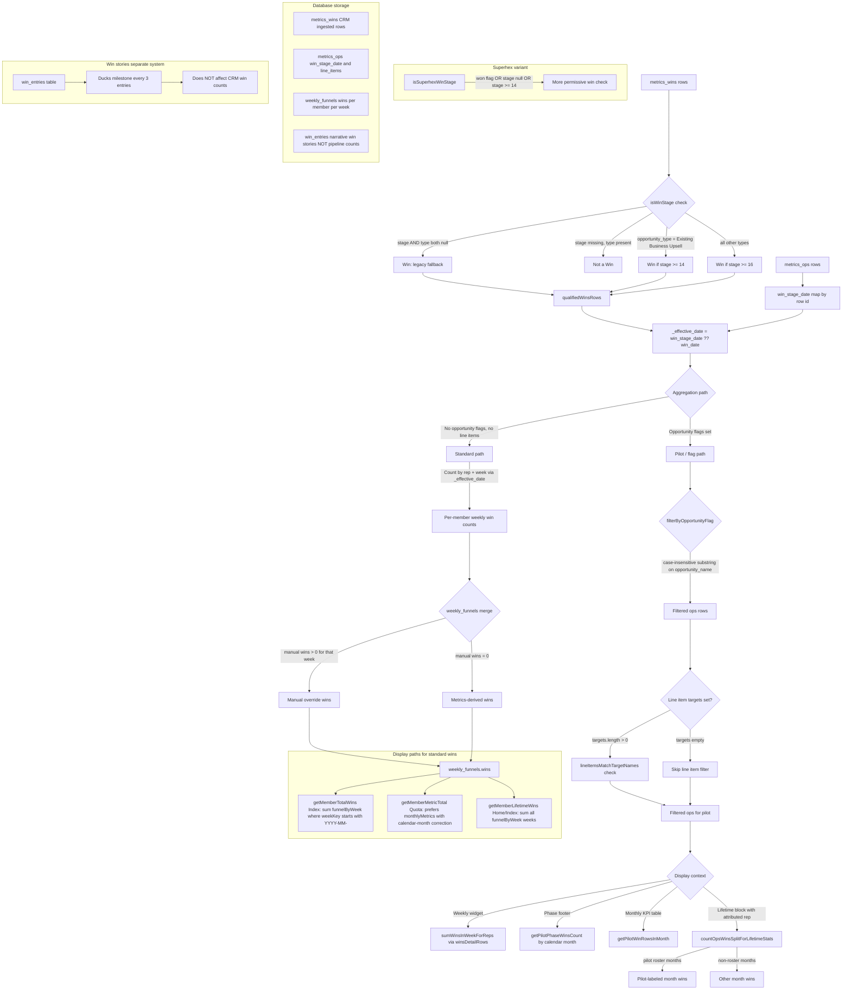

# Win calculation

How CRM wins are determined, aggregated, and displayed in this app—including variations (pilot flags, line items, manual overrides, Superhex, win stories).

## Key files

- [`src/lib/metrics-helpers.ts`](../src/lib/metrics-helpers.ts) — `isWinStage`, `isSuperhexWinStage`
- [`src/contexts/TeamsContext.tsx`](../src/contexts/TeamsContext.tsx) — `loadMetrics`, merge into `weekly_funnels`
- [`src/lib/pilot-helpers.ts`](../src/lib/pilot-helpers.ts) — flag / line item / pilot path
- [`src/lib/quota-helpers.ts`](../src/lib/quota-helpers.ts) — `getMemberMetricTotal`, `getPhaseWinsLabel`
- [`src/pages/Index.tsx`](../src/pages/Index.tsx) — `getMemberTotalWins`, `pilotWinsInWeek`, display widgets

## Win calculation flow

## Per-phase configuration

`team_phase_configs` stores per test-phase month (`month_index`): `opportunity_flags` and `line_item_targets` (JSON arrays), plus `attach_rate_denom` (`flagged_wins` | `all_wins`) for the pilot attach-rate denominator. [`resolvePhaseCalcConfig`](../src/lib/phase-calc-config.ts) uses that row when present; otherwise it falls back to `teams.overall_goal_opportunity_flag` and `teams.overall_goal_line_item_targets` (and `flagged_wins` for attach denominator). Phase footers (`getPilotPhaseWinsCount`), weekly pilot wins (`pilotWinsInWeek` → `sumWinsInWeekForReps`), attributed lifetime splits (`countOpsWinsSplitForLifetimeStats`), and pilot KPI blocks on Index resolve flags/targets per phase month.

**Manual edits** (`team_metric_exclusions`): per-team rules scoped by `month_key`. **`member_id`** when set limits the rule to that rep’s counts/hovers; `null` applies to the whole team. **`kind = exclusion`** (default) drops matching rows from funnel counts (and pilot KPI raw rows, team-wide rules only) when `opportunity_name` or `account_name` matches; excluded rows still show on the Data page. **`kind = inclusion`** adds +1 for the month when no matching row exists (no double count if stream data already matches). Demos in the funnel only count when `metrics_demos.event_status` is **Completed** (case-insensitive).

## Variation summary

| Topic | Behavior |
| --- | --- |
| **Stage thresholds** | Upsell (`Existing Business (Upsell)`) = 14+, all other types = 16+ |
| **Superhex** | `isSuperhexWinStage`: explicit won flag → win; null stage → win; numeric stage → 14+; non-numeric → not a win |
| **Manual override** | If `weekly_funnels.wins > 0` for that member/week, that value wins over metrics-derived count for that cell |
| **Opportunity flags** | Case-insensitive substring on `opportunity_name` scopes pilot-style views |
| **Line item targets** | When targets are configured, `lineItemsMatchTargetNames` gates which opps count; empty targets → no line-item filter |
| **Effective date** | `win_stage_date` from `metrics_ops` (by row id) takes priority over `win_date` on the win row |
| **Display divergence** | `getMemberTotalWins` sums funnels by week-key prefix; `getMemberMetricTotal(..., "wins")` uses calendar-month-corrected `monthlyMetrics` — same month can differ |
| **Win stories** | `win_entries` are narrative only; every 3 stories → duck milestone; no effect on CRM win counts |

## Upstream data notes

Product/help copy may describe source-specific rules (e.g. union of views, duplicate offers). The app implements the `isWinStage` + `metrics_wins` / `metrics_ops` merge behavior above.
